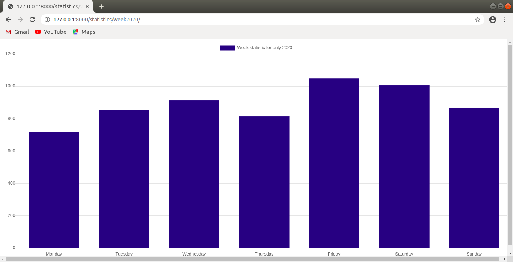

# graph-The-Donald
#### A project that creates statistics for Donald Trump tweets in the period 2014-2020.
# Used technologies
**MongoDB**
**Django**
**Charts.js**

# Installation

1. Install MongoDB : https://docs.mongodb.com/manual/administration/install-community/

2. Download all Donald Trump tweets from here - http://trumptwitterarchive.com/data/realdonaldtrump/

3. Start MongoDB server:

-  $ sudo service mongod start  - for Linux
   
-  $ mongoimport --db {dbName} --collection {colectionName} --file {jsonFileName} [--jsonArray]  - If you want to import database and collections

4. Clone this repo

  
